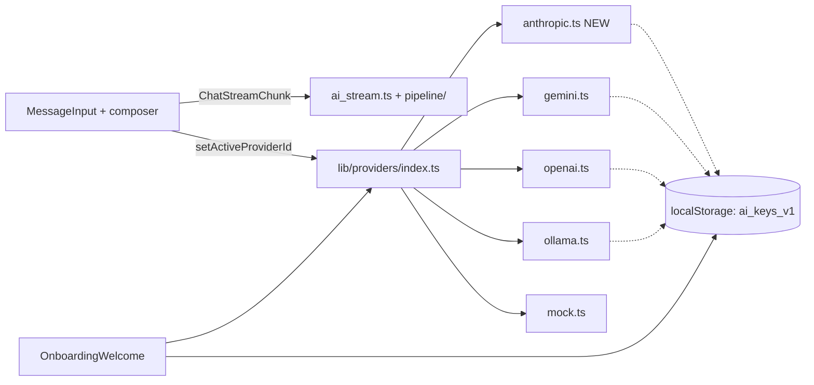

# Requirements

### Overview & Goals
Bring EduSpark's chat surface in line with Claude's composer aesthetic, keep the experience **zero-ops / BYOK** (paste a free Gemini key and go), and widen the provider abstraction so Claude (for users with an Anthropic key) and Ollama (local) are first-class siblings of Gemini. No server credentials required, minimal code added — we reuse the existing `AIProvider` contract and the Claude-style design tokens already in `app/globals.css`.

### Scope

**In Scope**
1. **Unify the aesthetic on the Claude warm-paper palette** already declared in `globals.css` (`--color-bg`, `--color-surface`, `--color-sidebar`, `--color-border`, `--color-ink`, `--color-accent`, `--color-muted`). Today they're only used in onboarding/settings; the chat (`MessageInput`, `MessageList`, `Sidebar`, `Header`, `ChatContainer`) still hard-codes `#d44d29`, `#1a1a1a`, `#f9f9f9`, `#ababab`, etc.
2. **Redesign `MessageInput`** to match Claude's rectangular composer: a tall, rounded-rectangle textarea on top with a bottom action bar containing `+` (attachment menu → URL / File), a model picker chip, and the send button on the right. Plus button moves **below** the textarea.
3. **Add Anthropic (Claude) as a first-class provider** under `lib/providers/anthropic.ts`, with the same `AIProvider` surface (`chat` stream + `ping`) the other providers use. Surfaced in onboarding as a second option for users with Claude Pro / an Anthropic key; Gemini stays the recommended free path.
4. **Emphasize Gemini as the recommended BYOK default** in onboarding copy and in the composer's model chip, and keep Ollama's "run locally" card intact.
5. **File & URL attachments menu** behind `+`, with a hard per-file size ceiling (keep the existing 2 MB image cap as "max").
6. **Dynamic footer** — replace the static "Powered by Gemini 3.1" string with the live active provider/model (e.g. "Powered by Gemini 2.5 Flash" or "Powered by Claude 3.5 Sonnet").

**Out of Scope**
- Anything that introduces a server / requires API keys on the deploy target (must remain zero-ops).
- Rewriting the pipeline, roadmap, or artifact panes.
- Multimodal Claude input (PDF ingestion) — the file attachment stays image-only for now.
- New RTL / style-gallery work (already shipped per `UI_ROADMAP.md`).

### User Stories
- *As a new visitor*, I want to paste a free Gemini API key and start building a workbook, so I never need to pay or sign up.
- *As a Claude Pro subscriber*, I want to paste my Anthropic key and have EduSpark route chat through Claude, so I use the model I already pay for.
- *As a privacy-conscious user*, I want to keep running Ollama locally the way the README describes, with no regression.
- *As any user*, I want the composer to look and feel like Claude's — rectangular box, plus button underneath for attaching a URL or a file, clean typography — so the app feels premium and familiar.

### Functional Requirements
- The entire chat surface (messages, sidebar, header, composer) reads color from `var(--color-*)` tokens — no stray `#d44d29`/`#1a1a1a` literals remain in `components/chat/**` and `components/layout/Header.tsx`.
- The composer:
  - Is a rounded rectangle (~`rounded-2xl`, taller min-height, Claude-like interior padding).
  - Textarea auto-grows (up to ~8 lines) with `custom-scrollbar`.
  - Bottom action bar contains: `+` button (opens a small popover with *Attach file* and *Add URL*), a compact model-picker chip that shows the active provider + model, and a circular send button on the trailing edge.
  - `+ → Attach file` replaces the current hidden image-only `<input>` and reuses `onImageUpload` for image files (PNG/JPG/WebP ≤ 2 MB).
  - `+ → Add URL` reuses `onAddResource` (calls the existing research pipeline).
  - The old AI-Research-Query quick action stays, moved inside the `+` menu.
- Anthropic provider:
  - Adds `lib/providers/anthropic.ts` using `@anthropic-ai/sdk` (already in `package.json`? — if not, add it; we will run it browser-side with the `dangerouslyAllowBrowser: true` flag since keys are BYOK in `localStorage`, matching how `openai` is used today).
  - Registered in `lib/providers/index.ts` (`AVAILABLE_PROVIDERS`, `providers` map, `ProviderId` union).
  - Credentials managed by the existing `lib/ai/keys.ts` (`readCreds`/`writeCreds`/`getKey('anthropic')`/`getModel('anthropic')`).
  - Model list: `claude-3-5-sonnet-latest`, `claude-3-5-haiku-latest`.
  - `ping()` does a 1-token request and reports latency.
  - Tool-calling: mirrors the Gemini `propose_roadmap`/`build_workbook` tool schema so the existing `ai_stream.ts` pipeline keeps working unchanged.
- Onboarding (`OnboardingWelcome`):
  - Gemini card is labeled **Recommended · Free** and is rendered first.
  - Claude card appears next to Ollama, with microcopy "Use your Anthropic key (Claude Pro users)".
  - Routes to a new `AnthropicSetupStep` (same shape as `GeminiSetupStep`).
- Settings panel already iterates `AVAILABLE_PROVIDERS`; Anthropic gets a block analogous to the Gemini/OpenAI one (key input + model select + *Test connection*).
- Header `ProviderSwitcher` automatically picks up the new provider.

### Non-Functional Requirements
- Zero-ops deploy (Vercel) still works with no `NEXT_PUBLIC_*` vars; the app still gates on `hasUsableCredential()`.
- No increase in bundle size of the *initial* route: load `anthropic` only on demand (`await import('@anthropic-ai/sdk')` inside the provider, matching how `ollama_pull.ts` lazy-loads).
- All new strings pass the existing `dir="rtl"` logic.
- No change to the pipeline contract (`BuildWorkbookArgs`, `Workbook`, `ChatStreamChunk`).

# Technical Design

### Current Implementation
- **Palette duality.** `app/globals.css` defines Claude-style tokens, used by `OnboardingWelcome.tsx`, `GeminiSetupStep.tsx`, `OllamaSetupStep.tsx`, and `SettingsPanel.tsx`. The chat surface (`components/chat/*`, `components/layout/Header.tsx`) still hard-codes the older terracotta/black palette — this is the root cause of the "doesn't look like Claude" feedback.
- **Composer.** `components/chat/MessageInput.tsx` is a single-row pill: textarea with absolutely-positioned icons (`+` on the left, URL on the right, send on the far right). Footer reads `EduSpark v2.0 · Powered by Gemini 3.1` (hard-coded).
- **Provider registry.** `lib/providers/index.ts` exposes `ProviderId = 'mock' | 'gemini' | 'openai' | 'ollama'`, each implementing `AIProvider` from `lib/providers/types.ts` (`chat` async-generator + optional `ping`). Keys live in `localStorage` under `eduspark_ai_keys_v1` via `lib/ai/keys.ts`.
- **Onboarding.** `OnboardingWelcome.tsx` shows two cards (Gemini, Ollama) plus a demo link; `SettingsPanel.tsx` has an accordion for OpenAI as "Advanced providers."

### Key Decisions
1. **Token-first refactor, not a redesign.** We do not invent new colors; we simply replace hard-coded hex values in chat/header/sidebar with `var(--color-*)` references and a few Tailwind arbitrary-value classes (e.g. `bg-[var(--color-surface)]`). This keeps the diff small and makes future theming trivial.
2. **Reuse the `AIProvider` contract for Claude.** Anthropic is added as a fourth provider entry — no abstraction changes. Tool calling is mapped to Anthropic's native `tools` schema in `anthropic.ts`. *Rationale:* the whole point of the existing abstraction is that new models plug in with ~250 LOC; we honor that.
3. **Browser-side Claude calls with BYOK.** Mirrors how `lib/providers/openai.ts` already works. Users' keys never touch our server. We pass `dangerouslyAllowBrowser: true` and disclose this in the Anthropic setup step's microcopy (same disclosure tone as Gemini/OpenAI).
4. **Composer is a single component, no new primitive.** We restructure `MessageInput.tsx` in place rather than introducing a `Composer` package — avoids churn and keeps the file the single source of truth.
5. **Default model pickers live in the composer chip**, not in a separate settings trip. The chip calls `getActiveProviderId()` / `getModel(...)` and writes via `setActiveProviderId` / `writeCreds`.
6. **Gemini stays the recommended default** and the onboarding / composer copy reflects that. Claude is offered but never pushed.

### Proposed Changes

#### 1. Palette unification
- `components/chat/MessageInput.tsx`, `components/chat/MessageList.tsx`, `components/chat/Sidebar.tsx`, `components/chat/ChatContainer.tsx`, `components/chat/ProgressiveStatus.tsx`, `components/chat/ThinkingBlock.tsx`, `components/layout/Header.tsx`:
  - `#1a1a1a` → `var(--color-ink)`
  - `#d44d29` → `var(--color-accent)`
  - `#f9f9f9` / `#f0f0f0` / `#ececec` → `var(--color-sidebar)` or `var(--color-bg)` as appropriate
  - `#e5e5e5` → `var(--color-border)`
  - `#ababab` / `#8e8e8e` / `#4a4a4a` → `var(--color-muted)` (with opacity tweaks)
  - User bubble: change from solid black to `var(--color-ink)` with the accent as border-left (Claude-style).

#### 2. Composer redesign
New internal layout of `components/chat/MessageInput.tsx`:

```
┌────────────────────────────────────────────────┐
│  <textarea rows=1..8 auto-grow>                │
│                                                │
├────────────────────────────────────────────────┤
│  [+]  [ Gemini · Flash ▾]            [ ↑ ]    │
└────────────────────────────────────────────────┘
      ^ attach menu       ^ model chip   ^ send
```

- The outer wrapper becomes a single rounded-rectangle card: `bg-[var(--color-surface)] border border-[var(--color-border)] rounded-2xl shadow-sm focus-within:border-[var(--color-accent)]/60 focus-within:ring-2 focus-within:ring-[var(--color-accent)]/15`.
- The `+` popover menu reuses the existing *Upload Image*, *Research URL*, *AI Research Query* items — same handlers, new location.
- The model chip is a `<button>` that opens a `<select>`-style popover listing providers from `AVAILABLE_PROVIDERS` filtered to those with `hasUsableCredential(id)`; selecting one calls `setActiveProviderId(id)` and, if the provider exposes models, updates the default model via `writeCreds`.
- File attachment stays `accept="image/*"` and keeps the 2 MB guard (`file.size > 2 * 1024 * 1024`) — copy updated to clarify it's the maximum.
- Send button: circular, accent background when enabled, `var(--color-border)` disabled state.
- Footer line becomes dynamic: `Powered by {providerLabel} · {modelName}` derived from the provider registry.

#### 3. Anthropic / Claude provider
- Add dependency `@anthropic-ai/sdk` to `package.json` if not present (the `claude-api` skill is available — follow its prompt-caching and SDK patterns).
- New file `lib/providers/anthropic.ts`:
  ```ts
  export const anthropicProvider: AIProvider = {
    id: 'anthropic',
    label: 'Claude',
    async *chat(messages, opts) { /* stream via messages.create({stream:true}) */ },
    async ping() { /* 1-token echo, classify errors via lib/ai/errors.ts */ },
  };
  ```
  - Tools: `propose_roadmap` and `build_workbook` mirrored from `gemini.ts` but in Anthropic's tool-input JSON-Schema format.
  - Streaming: yield `ChatStreamChunk` shapes identical to `gemini.ts` so `ai_stream.ts` consumes them without changes.
  - Error handling via `classifyError` + `withBackoff` already in `lib/ai/errors.ts`.
  - Prompt caching: use `cache_control: { type: 'ephemeral' }` on the long system instruction (per the `claude-api` skill guidance).
- Register in `lib/providers/index.ts`: add `'anthropic'` to `ProviderId` union, `providers` map, and `AVAILABLE_PROVIDERS`.
- Extend `lib/ai/keys.ts` `ProviderCredentials` with an `anthropic: { apiKey, model }` slot.
- Extend `lib/providers/schemas.ts` with the Anthropic-shaped tool schema (if that's where Gemini's lives).

#### 4. Onboarding & settings
- `components/onboarding/OnboardingWelcome.tsx`: Gemini card gets a "Recommended · Free" pill (using `var(--color-accent)`); add a third button for Claude; keep the demo text link. If 3 cards get cramped, switch to a 1-col-mobile / 3-col-desktop grid.
- New `components/onboarding/AnthropicSetupStep.tsx`: clone of `GeminiSetupStep.tsx`, pointed at `console.anthropic.com/account/keys`, models `claude-3-5-sonnet-latest` / `claude-3-5-haiku-latest`.
- `components/layout/SettingsPanel.tsx`: lift OpenAI out of the "Advanced" accordion peer block and add an Anthropic peer block. Connection test uses `anthropicProvider.ping()`.

#### 5. Dynamic footer
- Tiny helper in `lib/providers/index.ts`: `getActiveProviderLabel(): { provider: string; model: string }`. `MessageInput.tsx` reads it in a `useSyncExternalStore` or simple `useState` + `storage`/custom-event to stay reactive when the user changes provider from the chip.

### Data Models / Contracts
```ts
// lib/providers/types.ts (unchanged)
export type ProviderId = 'mock' | 'gemini' | 'openai' | 'ollama' | 'anthropic';

// lib/ai/keys.ts — additive
export interface ProviderCredentials {
  gemini?: { apiKey?: string; model?: string };
  openai?: { apiKey?: string; model?: string };
  ollama?: { baseUrl?: string; model?: string };
  anthropic?: { apiKey?: string; model?: string }; // NEW
}
```

### Components
- **MessageInput.tsx** — rewritten layout, same props (`input`, `setInput`, `onSendMessage`, `onImageUpload`, `onAddResource`, `onInitiateResearch`, `isTyping`, `step`). No changes to `ChatContainer.tsx`'s call site.
- **Sidebar.tsx / MessageList.tsx / Header.tsx** — colors only, no prop changes.
- **OnboardingWelcome.tsx** — adds a third card + "Recommended" pill.
- **AnthropicSetupStep.tsx** (new) — form + ping, same pattern as Gemini step.
- **SettingsPanel.tsx** — adds an Anthropic credential block.
- **ProviderSwitcher.tsx** — no code change; it reads from `AVAILABLE_PROVIDERS` and will pick Claude up automatically.
- **anthropic.ts** (new provider).

### File Structure
```
app/
  globals.css                           (unchanged — already has tokens)
components/
  chat/
    MessageInput.tsx                    (redesign)
    MessageList.tsx                     (color pass)
    Sidebar.tsx                         (color pass)
    ChatContainer.tsx                   (color pass)
    ProgressiveStatus.tsx               (color pass)
    ThinkingBlock.tsx                   (color pass)
  layout/
    Header.tsx                          (color pass)
    SettingsPanel.tsx                   (+ Anthropic block)
  onboarding/
    OnboardingWelcome.tsx               (+ Claude card, + Recommended pill)
    AnthropicSetupStep.tsx              (NEW)
lib/
  providers/
    anthropic.ts                        (NEW)
    index.ts                            (register 'anthropic')
    schemas.ts                          (Anthropic tool schema, if used)
  ai/
    keys.ts                             (+ anthropic slot)
package.json                            (+ @anthropic-ai/sdk if missing)
```

### Architecture Diagram


### Risks
- **Anthropic browser-CORS**: `@anthropic-ai/sdk` supports `dangerouslyAllowBrowser: true`. If CORS shifts later, we might need a thin edge route — out of scope for now, but we'll document the fallback in the Anthropic setup step.
- **Tool-format drift**: Gemini vs Anthropic tool schemas differ; `ai_stream.ts` currently assumes Gemini-shaped tool events. Mitigation: normalize inside `anthropic.ts` so it emits the same `ChatStreamChunk` shape the rest of the app already consumes — no downstream changes.
- **Visual regression**: we're replacing many literal hex values. Mitigation: keep the replacement mechanical (one-to-one token map) and do a single-pass visual QA against the current screenshots.

# Testing

### Validation Approach
Because this is primarily a visual/structural refactor plus one new provider, validation centers on (a) behavior preservation in the chat flow, (b) visual consistency with the Claude tokens, and (c) a real end-to-end smoke test of the new Anthropic path using a dummy key via `mockProvider`-style stubs where needed.

### Key Scenarios
- **First-run BYOK (Gemini)** — zero-env deploy → `OnboardingWelcome` shows Gemini card marked *Recommended · Free* first, Claude second, Ollama third; picking Gemini → `GeminiSetupStep` → test → save → main app appears; composer footer reads *Powered by Gemini · gemini-2.5-flash*.
- **Composer Claude-aesthetic** — DOM inspection of the rendered composer shows a rectangular `<div>` wrapping `<textarea>` + bottom toolbar; `+` button lives in the toolbar row (not inside the textarea); clicking `+` opens a popover with *Attach file* / *Add URL* / *AI Research Query*.
- **URL research still works** — `+ → Add URL` calls `onAddResource`; research pipeline state transitions unchanged.
- **Image upload preserved** — `+ → Attach file`, >2 MB rejected with the existing alert; ≤2 MB fires `onImageUpload` and adds an illustration page to the workbook.
- **Claude provider happy path** — with an Anthropic key configured, `ProviderSwitcher` shows Claude, `anthropicProvider.ping()` returns `{ok:true}`, a small prompt streams via `chat()` and yields a `roadmap` tool call identical in shape to Gemini's.
- **Token coverage** — grep `components/chat/**` and `components/layout/Header.tsx` for literal hex colors returns **zero** `#d44d29` / `#1a1a1a` / `#f9f9f9` results.

### Edge Cases
- Provider without a usable credential is hidden from the composer's model chip list.
- Switching provider via the chip while `isTyping` is true is disabled.
- Anthropic `ping()` with an invalid key surfaces the same amber pill as Gemini (error classification via `lib/ai/errors.ts`).
- RTL mode (`dir="rtl"`): the composer's `+` stays at the start-edge and Send at the end-edge (flex handles this with `flex-row` + `dir`).
- Demo/mock mode still works and shows `Powered by Demo Mode · mock` in the footer.

### Test Changes
- Extend `tests/` (existing Vitest setup) with a component test for `MessageInput` asserting the new DOM structure (`toolbar` role, `+` button position, model chip presence).
- Add a provider-contract test that exercises `anthropicProvider.chat()` against a mocked fetch returning a streamed Anthropic event payload, asserting the produced `ChatStreamChunk[]` matches the shape yielded by `geminiProvider.chat()` for the same transcript.

# Delivery Steps

### ✓ Step 1: Stage 1 — Unify the chat surface on Claude palette tokens
Every color in the chat + header + sidebar comes from `var(--color-*)` tokens already defined in `app/globals.css`; no hard-coded hex remains in `components/chat/**` or `components/layout/Header.tsx`.

- Replace hard-coded hex values with CSS variables in:
  - `components/chat/MessageList.tsx`
  - `components/chat/Sidebar.tsx`
  - `components/chat/ChatContainer.tsx`
  - `components/chat/ProgressiveStatus.tsx`
  - `components/chat/ThinkingBlock.tsx`
  - `components/layout/Header.tsx`
- Mapping: `#1a1a1a → var(--color-ink)`, `#d44d29 → var(--color-accent)`, `#f9f9f9 / #f0f0f0 / #ececec → var(--color-sidebar) | var(--color-bg)`, `#e5e5e5 → var(--color-border)`, grey mutes → `var(--color-muted)`.
- User message bubble: restyle to Claude's warm-paper look (ink-on-cream with an accent left border).
- Leave prop signatures untouched — this stage is purely visual.

### ✓ Step 2: Stage 2 — Rebuild MessageInput as a Claude-style rectangular composer
The composer is a rounded-rectangle card with the textarea on top and a bottom action bar containing `+` (attachments/URL), a model chip, and the send button — matching Claude.

- Restructure `components/chat/MessageInput.tsx`:
  - Outer wrapper: `bg-[var(--color-surface)] border border-[var(--color-border)] rounded-2xl shadow-sm focus-within:border-[var(--color-accent)]/60`.
  - Auto-growing `<textarea>` (1–8 rows) on top, no absolute icons inside.
  - Bottom toolbar row with `+` button (popover: *Attach file*, *Add URL*, *AI Research Query*), a model-picker chip, and a circular send button on the trailing edge.
- Reuse existing handlers: `onImageUpload`, `onAddResource`, `onInitiateResearch` — no `ChatContainer` changes.
- File attachment stays `accept="image/*"` with the current 2 MB cap (copy clarifies "max").
- Replace the static `Powered by Gemini 3.1` footer with a dynamic line reading the active provider + model from the registry.
- Disable provider switching while `isTyping`.

### ✓ Step 3: Stage 3 — Add Anthropic (Claude) as a first-class provider
Users with an Anthropic key can select Claude and run the full roadmap/build pipeline without any change to `ai_stream.ts`.

- Add `lib/providers/anthropic.ts` implementing `AIProvider` (`chat` async generator + `ping`) using `@anthropic-ai/sdk` with `dangerouslyAllowBrowser: true` (BYOK, keys stay in `localStorage`).
- Consult the `claude-api` skill first; apply prompt caching (`cache_control: { type: 'ephemeral' }`) on the long system instruction.
- Map `propose_roadmap` and `build_workbook` to Anthropic's native tool-input JSON Schema; normalize streamed output to the existing `ChatStreamChunk` shape so `ai_stream.ts` is untouched.
- Route errors through `lib/ai/errors.ts` (`classifyError`, `withBackoff`).
- Register `'anthropic'` in `lib/providers/index.ts` (`ProviderId` union, `providers` map, `AVAILABLE_PROVIDERS`) and extend `ProviderCredentials` in `lib/ai/keys.ts` with an `anthropic` slot.
- Lazy-load the SDK (`await import('@anthropic-ai/sdk')`) to keep initial bundle size flat.
- Add a Vitest contract test in `tests/` verifying Anthropic's streamed output matches Gemini's `ChatStreamChunk` shape for the same transcript.

### ✓ Step 4: Stage 4 — Surface Claude in onboarding and settings, keep Gemini recommended
A first-time visitor sees Gemini marked as *Recommended · Free*, a Claude card for Anthropic key holders, and the Ollama card for local users; Settings mirrors the same three first-class providers.

- Update `components/onboarding/OnboardingWelcome.tsx`:
  - Add a *Recommended · Free* pill to the Gemini card.
  - Add a third card "Use Claude" with microcopy about Anthropic keys / Claude Pro.
  - Switch the grid to 1-col mobile / 3-col desktop so three cards fit cleanly.
- Add `components/onboarding/AnthropicSetupStep.tsx`: clone `GeminiSetupStep.tsx`, point the *Get a key* link at `console.anthropic.com/account/keys`, models `claude-3-5-sonnet-latest` and `claude-3-5-haiku-latest`, wire the *Test connection* button to `anthropicProvider.ping()`.
- Update `components/layout/SettingsPanel.tsx` to render an Anthropic credential block analogous to the Gemini/OpenAI blocks (key + model + ping).
- `ProviderSwitcher.tsx` picks up the new provider automatically via `AVAILABLE_PROVIDERS` — verify only, no code change.

### ✓ Step 5: Stage 5 — Wire the composer model chip and dynamic footer to the live registry
The composer's model chip shows the currently active provider and model and lets the user switch between any provider that has a usable credential; the footer reflects the choice instantly.

- Add `getActiveProviderLabel()` helper in `lib/providers/index.ts` returning `{ providerId, providerLabel, modelName }`.
- In `components/chat/MessageInput.tsx`:
  - Model chip opens a popover listing providers from `AVAILABLE_PROVIDERS` filtered to those with `hasUsableCredential(id)`.
  - Selecting one calls `setActiveProviderId(id)` and, when applicable, writes a default model via `writeCreds`.
  - Dispatch a small custom event (or use a React context) so the footer re-renders immediately without a page reload.
- Update the footer to render `Powered by {providerLabel} · {modelName}` using the helper.
- Add a Vitest component test for `MessageInput` asserting: rectangular wrapper, `+` in the toolbar, chip reflects the active provider, send button disabled on empty input, and dynamic footer text.