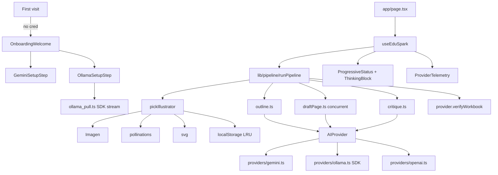

# Requirements

### Overview & Goals
Ship EduSpark as a **zero-ops BYOK product** where you (the owner) never pay for AI inference. Every visitor either:

1. **Brings their own Gemini API key** (free tier is generous; pasted once in-app), **or**
2. **Runs Ollama locally** — with a first-class, hand-held onboarding that walks them through install → run → pull-model right inside the app.

OpenAI stays supported but is demoted to an “Advanced providers” accordion.

In parallel, upgrade the **generation pipeline (“the car”)** around the AI so quality goes up: multi-step agentic loop, parallel page drafting, structured JSON page output, self-critique pass, and a real illustration subsystem (Imagen for Gemini users, opt-in Pollinations for Ollama users, cached by prompt hash).

This phase also **closes three deferred items** from the previous plan:
- `ProgressiveStatus` / `ThinkingBlock` not wired into `ArtifactPane` (fake percentage bar + neon terminal still render).
- `StyleCard` with live-SVG variants not rendered inside the in-app style gallery.
- Ollama still uses non-streaming `/api/generate`; the installed `ollama` SDK is unused.

### Scope

**In Scope**
1. **First-run BYOK onboarding** — full-screen Claude-style welcome, two big cards (Gemini / Ollama), re-openable from the gear icon.
2. **Ollama as a first-class local runtime** — OS-aware install instructions, `ollama serve` reminder, SDK token streaming, real byte-progress model pull, recommended model catalogue.
3. **Finish deferred UI wiring** — delete `GenerationSkeleton` fake percentage bar; render `ProgressiveStatus` + `ThinkingBlock`; render `StyleCard` grid with Warm/Cool/Bold variants.
4. **Demote OpenAI** — collapsed “Advanced providers” section in Settings; kept fully functional.
5. **Deploy-ready BYOK** — zero-key deploy works; missing-credential state is a real first-class UI, not a silent mock fallback.
6. **Engine upgrades (“the car”)** — pipeline `outline → draft (parallel) → self-critique → revise → illustrate → verify`; structured `StructuredPage` JSON; bounded concurrency.
7. **Illustration subsystem** — `lib/illustration/` with Imagen (Gemini), Pollinations.ai (opt-in, zero-auth), SVG (default), plus LRU `localStorage` cache.
8. **Provider telemetry** — tiny footer pill showing model + last-call usage so users understand what their key is spending.

**Out of Scope**
- Claude / Anthropic provider.
- Multimodal **input** (PDF/image ingestion).
- Projects / persistent workspaces.
- Team / collaboration features.
- Any server-side proxying of user keys.

### User Stories
- *As a new visitor,* my first screen explains that EduSpark runs on **my own** Gemini key or **my own** local Ollama, and walks me through either path.
- *As a non-technical user,* I pick “Use Ollama” and see the exact one-line install command for my OS, a Download button, and a “Pull recommended model” button with a real progress bar.
- *As a Gemini user,* I paste my key once, pick a model, see a green “Connected · gemini-2.5-flash” pill, and never hit a payment prompt.
- *As a 6-page-workbook user,* the pipeline drafts 3 pages in parallel, self-critiques each, revises the weakest, and shows me a morphing one-liner — no percentage bars.
- *As a user picking a style,* I see **live SVG mini-spreads** with Warm/Cool/Bold variant pills.
- *As a user with Imagen access,* my workbook cover is a real generated illustration, not a flat SVG.
- *As an Ollama user,* I can opt-in to cover art via Pollinations without installing an image model.
- *As the owner,* I can deploy to Vercel with zero AI credentials attached and everything still works for end users who bring their own.

### Functional Requirements
- **No credential in env vars ⇒ no generation call fires.** UI shows a “Set up your provider” CTA that opens onboarding.
- Onboarding persisted in `localStorage['eduspark_onboarding_v1'] = { completed, provider }`.
- Ollama pull UI uses `ollama.pull({ stream: true })` and displays `percent = completed / total` (real bytes, not a fake bar).
- Illustration cache key = `sha1(provider + style + palette + title + description)`; hits return instantly.
- Parallel page generation uses a 20-line local `runWithConcurrency` helper (no new dep); default cap 3 (Flash 5, OpenAI 3, Ollama 1).
- Pipeline stages emit `tool_breadcrumb` chunks so `ThinkingBlock` shows a readable trace.

### Non-Functional Requirements
- No new server endpoints — strict client-side BYOK.
- All 29 existing vitest tests stay green.
- Zero secrets in repo; `.env.example` stays the single reference.
- Accessibility: onboarding keyboard-navigable, Ollama pull progress `aria-live="polite"`.
- Performance: parallel page generation shortens 6-page wall time by ≥ 50% on any streaming provider.

# Technical Design

### Current Implementation (verified on disk)
- **Providers** `lib/providers/{types,index,mock,gemini,openai,ollama}.ts` — Gemini & OpenAI stream token deltas; Ollama still uses non-streaming `/api/generate` with a `ping()` via `/api/tags`. The `ollama` npm SDK is installed but not imported.
- **Credentials** `lib/ai/keys.ts` — `readCreds`, `writeCreds`, `getKey`, `getBaseURL`, `getModel` backed by `localStorage['eduspark_ai_keys_v1']` with `NEXT_PUBLIC_*` fallback.
- **Errors** `lib/ai/errors.ts` — `classifyError` + `withBackoff` (200/600/1800 ms).
- **Memory** `lib/memory.ts` — wired into `lib/ai_stream.ts`.
- **UI atoms** `ProgressiveStatus`, `ThinkingBlock`, `StyleCard` — **built and exported but never rendered**. `ArtifactPane.tsx` still shows `GenerationSkeleton` (fake % bar at lines 298–351) and flat `StyleGallery` (color-dot cards at lines 353–411).
- **Settings** `components/layout/SettingsPanel.tsx` — exists, opened from a gear in `Header.tsx`, BYOK fields + test-connection for all three providers.
- **Hook** `hooks/useEduSpark.ts` — exposes `phase` + `breadcrumbs` and accumulates `delta` text chunks; `startGeneration` is still a linear `for` loop (no parallelism, no critique).
- **Illustration** `lib/ai.ts#generateSVGIllustration` → provider SVG only; no Imagen; Ollama delegates to `mockProvider`.
- **Themes** `lib/themes.ts` already has optional `variants?: [...]` on `WorkbookStyle`.
- **Onboarding** — none. If no key is set, the app silently falls back to `mockProvider`, which misleads end users.

### Key Decisions
1. **BYOK-only by default: “no credential configured” becomes a first-class UI state.** `lib/providers/index.ts` exposes `hasUsableCredential()`; `app/page.tsx` renders `<OnboardingWelcome>` when false. Keeps the mock provider as an opt-in “demo mode” link for developers.
2. **Walk Ollama setup end-to-end inside the app** (install → run → pull) via a dedicated `OllamaSetupStep`. OS detected via `navigator.platform`; pull progress driven by the official `ollama` SDK.
3. **Move workbook orchestration into `lib/pipeline/`** — a pure, testable state machine (`outline → draftPages (concurrent) → critiqueAndRevise → illustrate → verify`). `useEduSpark.startGeneration` becomes a thin adapter that maps hooks to React state.
4. **Introduce `StructuredPage` JSON** alongside HTML `content`. Providers are asked via schema-constrained output (Gemini `responseSchema`, OpenAI `response_format: json_schema`, Ollama `format: 'json'`). HTML is derived from blocks for back-compat & export.
5. **Illustration is its own subsystem `lib/illustration/`** with provider-aware strategy: `Imagen` (Gemini BYOK) → `Pollinations` (opt-in, zero-auth) → `SVG` (default). All wrapped by a `localStorage` LRU cache (50 entries).
6. **Parallel page generation uses a 20-line inline concurrency limiter** (no new dep). Per-provider cap: Gemini Flash 5, OpenAI 3, Ollama 1 (local CPU).
7. **Demote OpenAI without removing it.** Keep provider/tests; hide the card behind `Advanced providers` accordion in `SettingsPanel`.

### Proposed Changes

#### A. BYOK onboarding
- **New** `components/onboarding/OnboardingWelcome.tsx` — full-screen welcome (“Bring your own AI.”), two big cards + a tiny “Use demo mode” link.
- **New** `components/onboarding/GeminiSetupStep.tsx` — key input + model picker + live ping.
- **New** `components/onboarding/OllamaSetupStep.tsx` — *Install* (OS-detected `curl` / Download) → *Run* (`ollama serve` + Check) → *Pull* (dropdown + live progress).
- **Extend** `lib/ai/keys.ts`: `hasUsableCredential`, `markOnboardingComplete`, `readOnboardingState`, `consent` flags.
- **Update** `app/page.tsx` to gate the main UI on `readOnboardingState().completed || hasUsableCredential()`.

#### B. Ollama first-class
- **Rewrite** `lib/providers/ollama.ts` using `import ollama from 'ollama/browser'`; `ollama.chat({ stream:true })` yields `{type:'text', delta:true}`; `ping()` via `ollama.list()`; `summarize()` via a non-streaming call.
- **New** `lib/providers/ollama_pull.ts` — `async function* pullModel(name)` wrapping `ollama.pull({ stream:true })`, emitting `{status, percent}`.
- Keep `/api/generate` only as a console-logged CORS fallback.
- Document `OLLAMA_ORIGINS="*"` in README + OllamaSetupStep.

#### C. Finish deferred UI wiring
- `components/artifact/ArtifactPane.tsx`:
  - Delete `GenerationSkeleton` (lines 298–351).
  - Render `<ProgressiveStatus phase={phase} />` + `<ThinkingBlock breadcrumbs={breadcrumbs} />` during `composing | illustrating | verifying`.
  - Remove `progress` prop; update `ArtifactPaneProps` and `app/page.tsx`.
  - Refactor inline `StyleGallery` to render `<StyleCard style onSelect />` grid with variant pills.
- `app/page.tsx#handleSelectStyle(style, variantKey)` merges `style.palette` with `variants.find(v=>v.key===variantKey)?.paletteOverride`, adds variant name to chat message, threads palette into `startGeneration`.
- `hooks/useEduSpark.ts`: drop numeric `progress`; `startGeneration` calls `runPipeline()`.

#### D. Pipeline (“the car”)
- **New** `lib/pipeline/index.ts` — orchestrator `runPipeline(args, hooks)`.
- **New** `lib/pipeline/outline.ts` — JSON-schema page list.
- **New** `lib/pipeline/draftPage.ts` — produces `StructuredPage`.
- **New** `lib/pipeline/critique.ts` — score /10, revise if < 8.
- **New** `lib/pipeline/concurrency.ts` — `runWithConcurrency(tasks, n)`.
- **New** `lib/pipeline/types.ts` — `Block`, `Exercise`, `StructuredPage`, `PipelineHooks`.
- **Extend** `WorkbookPage` with optional `structured?: StructuredPage` (HTML `content` stays).
- **Extend** `AIProvider` with optional `generateStructuredPage(spec)` (default impl wraps `generateContentPage`).

#### E. Illustration subsystem
- **New** `lib/illustration/{types,imagen,pollinations,svg,cache,index}.ts`.
- Imagen → `ai.models.generateImages({model:'imagen-3.0-generate-001',…})`.
- Pollinations → `https://image.pollinations.ai/prompt/{encoded}?nologo=true`, gated on `consent.pollinations`.
- SVG → wraps provider.
- Cache → `localStorage['eduspark_illust_cache_v1']` LRU 50.
- `pickIllustrator(provider, consent)` returns `Cached(Imagen ?? Pollinations ?? SVG)`.
- Update `lib/ai.ts#generateSVGIllustration` to delegate here; `WorkbookPreview.tsx` renders `` or SVG based on `kind`.

#### F. Provider telemetry & polish
- **New** `components/layout/ProviderTelemetry.tsx` — pill at bottom-right.
- Providers emit `{type:'usage', promptTokens?, completionTokens?, latencyMs}` at stream end.
- Hide OpenAI inside `<Accordion label="Advanced providers">` in `SettingsPanel`.

### Data Models / Contracts
```ts
// lib/pipeline/types.ts
export type Block =
 { kind: 'heading'; level: 1|2|3; text: string }
 { kind: 'paragraph'; text: string }
 { kind: 'list'; ordered: boolean; items: string[] }
 { kind: 'callout'; tone: 'tip'|'warn'|'example'; text: string }
 { kind: 'math'; latex: string };

export interface Exercise {
  id: string; prompt: string;
  kind: 'multiple_choice'|'short_answer'|'numerical'|'essay';
  choices?: string[]; answer: string; explanation?: string;
}

export interface StructuredPage {
  title: string;
  type: 'introduction'|'lesson'|'exercise'|'review';
  blocks: Block[];
  exercises?: Exercise[];
  teacherNotes?: string[];
}

export interface PipelineHooks {
  onStage(stage: string): void;
  onBreadcrumb(label: string): void;
  onPageUpdate(index: number, page: WorkbookPage): void;
}

// lib/providers/types.ts additions
export interface AIProvider {
  generateStructuredPage?(spec): Promise<StructuredPage>;
}
export type ChatStreamChunk =
 /* existing... */
 { type: 'usage'; promptTokens?: number; completionTokens?: number; latencyMs?: number };
```

### Components
 Component | Status | Change |
---|---|---|
 `components/onboarding/OnboardingWelcome.tsx` | **new** | Full-screen welcome |
 `components/onboarding/GeminiSetupStep.tsx` | **new** | Key + model + ping |
 `components/onboarding/OllamaSetupStep.tsx` | **new** | Install → run → pull |
 `components/layout/SettingsPanel.tsx` | existing | Collapse OpenAI; add Pollinations consent |
 `components/layout/ProviderTelemetry.tsx` | **new** | Footer usage pill |
 `components/artifact/ArtifactPane.tsx` | existing | Remove `GenerationSkeleton`; wire `ProgressiveStatus`+`ThinkingBlock`; swap to `StyleCard` grid |
 `components/WorkbookPreview.tsx` | existing | Render img or svg based on `illustration.kind` |
 `hooks/useEduSpark.ts` | existing | Drop `progress`; `startGeneration` → `runPipeline` |
 `lib/pipeline/*` | **new** | Orchestrator + outline/draft/critique/concurrency |
 `lib/illustration/*` | **new** | Imagen + Pollinations + SVG + cache |
 `lib/providers/ollama.ts` | existing | Rewrite with `ollama` SDK streaming |
 `lib/providers/ollama_pull.ts` | **new** | Pull progress generator |
 `lib/ai/keys.ts` | existing | `hasUsableCredential`, onboarding state, consent |
 `app/page.tsx` | existing | Gate on onboarding; variant-aware style select |

### Architecture Diagram


### Risks
- **Ollama CORS** — mitigate with `OLLAMA_ORIGINS="*"` docs + non-streaming fallback.
- **Imagen availability** — not all keys have quota; 4xx → silent SVG fallback + breadcrumb note.
- **Pollinations privacy** — prompt leaves the machine; require explicit opt-in + visible credit.
- **Parallelism vs memory** — pipeline calls are one-shot per page; no conversation-history conflict with `compactIfNeeded`.
- **JSON refusals** — retry once with plain text + regex extraction; otherwise fall back to legacy HTML path.
- **Existing users** — auto-mark onboarding complete if legacy `eduspark_ai_keys_v1` already has a key.

# Testing

### Validation Approach
After every stage run `npx tsc --noEmit` and `npx vitest run`. All 29 existing tests must stay green. Add focused unit tests for the new pure-logic subsystems (pipeline concurrency, illustration cache, Ollama pull progress, onboarding state). Manually smoke test onboarding & pipeline in `npm run dev`.

### Key Scenarios
- **First-run onboarding — Gemini path**: clear `localStorage`; reload; `OnboardingWelcome` renders; paste a Gemini key; ping succeeds → green pill; onboarding marks complete; chat opens.
- **First-run onboarding — Ollama path**: clear `localStorage`; reload; pick Ollama; `ping()` detects running instance (else shows install card with OS-detected command); pick `llama3.2`; click *Pull* → real byte-progress 0→100%; model appears in dropdown; first chat streams token-by-token.
- **Pipeline parallelism**: request a 6-page workbook on Gemini; via breadcrumbs, confirm 3 drafts fly in parallel; self-critique runs; at least one low-score page triggers a revise pass.
- **Illustration routing**: Gemini → Imagen image; Ollama + Pollinations off → SVG; Pollinations on → ``; second gen of same title hits cache (<10 ms).
- **Claude-style feedback, verified**: grep mounted DOM during generation → zero `%` digit strings; exactly one morphing line; breadcrumbs visible.
- **Style card variants**: Style gallery shows live SVG mini-spreads; pick *Classic Academia · Bold* → chat includes variant name; workbook uses Bold palette.
- **No-credentials deploy**: build with zero `NEXT_PUBLIC_*` vars → visit → `OnboardingWelcome` shown; all generation CTAs gated.

### Edge Cases
- **Ollama not installed** — ping fails → install card shown with OS-detected command.
- **Ollama running, zero models** — ping succeeds with empty list → pull step mandatory.
- **Pull interrupted** — cancel mid-download → retry button; no stale progress.
- **Imagen 403** — auto-fallback to SVG + one-line breadcrumb.
- **Structured JSON malformed** — retry plain-text + regex; else legacy HTML path.
- **Empty concurrency input** — `runWithConcurrency([], 3)` returns `[]` (no deadlock).
- **Cache invalidation** — palette/style/provider change → new key.
- **RTL Hebrew** — onboarding mirrors; install commands stay LTR inside `<code>`.

### Test Changes
- **New** `tests/pipeline.concurrency.test.ts` — cap=3 actually caps, preserves order, handles empty, propagates errors.
- **New** `tests/illustration.cache.test.ts` — round-trip, LRU eviction at 50, key stability.
- **New** `tests/ollama_pull.test.ts` — fake async iterator of `{completed,total,status}` → assert monotonic 0–100 percent.
- **New** `tests/onboarding.state.test.ts` — `hasUsableCredential` true after `writeCreds({gemini:{apiKey}})`; `markOnboardingComplete` persists; legacy-key auto-completion.
- **Update** `tests/useEduSpark.test.ts` — replace old linear-loop expectation with a pipeline-based mock emitting `onStage` / `onPageUpdate`.

# Delivery Steps

### ✓ Step 1: Stage 1 — Finish deferred UI wiring (ProgressiveStatus, ThinkingBlock, StyleCard)
The Claude-style generation UI and interactive style gallery are actually visible during real usage — no more fake percentage bar, no more neon terminal, no more flat color-dot cards.

- Delete `GenerationSkeleton` (lines 298–351) from `components/artifact/ArtifactPane.tsx` and remove every reference.
- During steps `composing | illustrating | verifying`, render `<ProgressiveStatus phase={phase} />` + `<ThinkingBlock breadcrumbs={breadcrumbs} />` wrapped in a centered warm-paper card.
- Remove the `progress` prop from `ArtifactPaneProps` and delete the numeric `progress` state in `hooks/useEduSpark.ts` (already unused downstream).
- Refactor the inline `StyleGallery` function in `ArtifactPane.tsx` to render a responsive grid of `<StyleCard style={s} onSelect={(style, variantKey)=>…}/>` with Warm/Cool/Bold variant pills from `lib/themes.ts`.
- Update `handleSelectStyle` in `app/page.tsx` to accept `(style, variantKey)`, merge `style.palette` with `variants.find(v=>v.key===variantKey)?.paletteOverride`, include the variant name in the AI chat message, and pass the merged palette through `startGeneration` via a new `colorPaletteOverride` field on `BuildWorkbookArgs`.
- Audit the codebase (`grep` for literal `%` and `progress`) to confirm zero remaining percentage indicators in user-facing components.
- Verify existing tests still pass (`npx vitest run`).

### ✓ Step 2: Stage 2 — First-run BYOK onboarding flow (Gemini path)
A first-time visitor sees a Claude-style welcome explaining BYOK and is walked through entering their own Gemini key; the main app is gated until a usable credential exists.

- Extend `lib/ai/keys.ts` with `hasUsableCredential(providerId?)`, `markOnboardingComplete(provider)`, `readOnboardingState()` (backed by `localStorage['eduspark_onboarding_v1']`), and auto-complete onboarding if a legacy key already exists in `eduspark_ai_keys_v1`.
- Create `components/onboarding/OnboardingWelcome.tsx` — full-screen Claude-style layout with the headline *“Bring your own AI”*, two big cards (Gemini / Ollama), and a tiny “Use demo mode” text link that falls back to `mockProvider`.
- Create `components/onboarding/GeminiSetupStep.tsx` — `type=password` key input, model dropdown (`gemini-2.5-flash` / `gemini-2.5-pro`), *Test connection* button calling `geminiProvider.ping()`, success pill + explanatory microcopy, “Get a free key” link to AI Studio.
- Update `app/page.tsx` to render `<OnboardingWelcome />` when `!readOnboardingState().completed && !hasUsableCredential()`; otherwise render the existing app; re-openable from the gear icon in `Header.tsx`.
- Update `README.md` with the BYOK product note: “Deploys work without any server-side keys; users bring their own Gemini or connect their own Ollama.”
- Add `tests/onboarding.state.test.ts` covering `hasUsableCredential`, `markOnboardingComplete`, and legacy-key auto-completion.

### ✓ Step 3: Stage 3 — Ollama as a first-class local runtime (SDK streaming + pull progress)
Any user can install Ollama, connect from the app, pull a recommended model with real byte-progress, and chat with token-by-token streaming — entirely from the onboarding flow.

- Rewrite `lib/providers/ollama.ts` to use `import ollama from 'ollama/browser'`: `ollama.chat({ model, messages, stream:true })` yields `{type:'text', delta:true}` chunks per token; `ping()` uses `ollama.list()`; `summarize()` uses a non-streaming `ollama.chat` call; keep the old `/api/generate` path as a console-logged CORS fallback.
- Create `lib/providers/ollama_pull.ts` exporting `async function* pullModel(name)` wrapping `ollama.pull({ model, stream:true })`, translating each `{completed,total,status}` chunk into `{status, percent}` bounded 0–100.
- Create `components/onboarding/OllamaSetupStep.tsx` with three sub-steps:
  1. **Install** — detect OS via `navigator.platform` and show the right command (`curl -fsSL https://ollama.com/install.sh | sh` / Download buttons for macOS / Windows).
  2. **Run** — remind user to run `ollama serve`, with a *Check connection* button that calls `ollamaProvider.ping()` and explains `OLLAMA_ORIGINS="*"` for the browser-CORS case.
  3. **Pull a model** — dropdown of recommended models (`llama3.2`, `qwen2.5`, `gemma2`, `llava`), a *Pull* button that drives `pullModel()` into a real progress bar with `aria-live="polite"`, then populates the model selector.
- Wire `OllamaSetupStep` into `OnboardingWelcome` and into `SettingsPanel.tsx` (replacing today’s flat Ollama section).
- Update `.env.example` / README with `OLLAMA_ORIGINS="*"` guidance.
- Add `tests/ollama_pull.test.ts` feeding a fake async iterator and asserting monotonic percent output.

### ✓ Step 4: Stage 4 — Pipeline orchestrator (“the car”): outline, parallel drafts, self-critique
Workbook generation runs through a pure, testable pipeline that drafts pages in parallel, critiques each one, and revises the weakest — replacing the linear `for` loop in `useEduSpark.startGeneration`.

- Create `lib/pipeline/types.ts` with `Block`, `Exercise`, `StructuredPage`, and `PipelineHooks` (`onStage`, `onBreadcrumb`, `onPageUpdate`).
- Create `lib/pipeline/concurrency.ts` with a 20-line `runWithConcurrency<T>(tasks, n)` (handles empty input, preserves order, propagates errors).
- Create `lib/pipeline/outline.ts` — calls the active provider with a JSON schema to return ordered page specs.
- Create `lib/pipeline/draftPage.ts` — calls `provider.generateStructuredPage?.(spec)` (with a default fallback that wraps `generateContentPage` + naive HTML-to-blocks parse).
- Create `lib/pipeline/critique.ts` — scores each page /10 on clarity/pedagogy/age-fit; for any page < 8, requests a targeted revision in a second batch.
- Create `lib/pipeline/index.ts#runPipeline(args, hooks)` sequencing `outline → draftPages (concurrent with per-provider cap: Gemini Flash 5, OpenAI 3, Ollama 1) → critiqueAndRevise → illustrate (deferred to Stage 5) → verify`, emitting readable `onBreadcrumb` labels.
- Extend `WorkbookPage` in `lib/types.ts` with optional `structured?: StructuredPage`.
- Replace the body of `startGeneration` in `hooks/useEduSpark.ts` with a thin adapter that calls `runPipeline` and maps hooks to `setPhase` / `setBreadcrumbs` / `setWorkbook`.
- Add `tests/pipeline.concurrency.test.ts` (cap, empty, order, errors) and update `tests/useEduSpark.test.ts` to a pipeline-based mock.

### ✓ Step 5: Stage 5 — Illustration subsystem (Imagen, Pollinations, SVG, cached)
Workbook illustrations switch from ad-hoc SVG to a pluggable, cached subsystem: Imagen for Gemini BYOK users, opt-in Pollinations for Ollama/offline users, SVG as the safe default.

- Create `lib/illustration/types.ts` with `Illustrator` and `IllustrationResult = { kind:'svg'; svg:string } | { kind:'image'; src:string; source:'imagen'|'pollinations' }`.
- Create `lib/illustration/imagen.ts` calling `ai.models.generateImages({ model:'imagen-3.0-generate-001', prompt, config:{ numberOfImages:1 } })` and returning a `data:image/png;base64,…` URL; classify 403/quota errors to silent fall-through.
- Create `lib/illustration/pollinations.ts` returning `https://image.pollinations.ai/prompt/${encodeURIComponent(prompt)}?width=1024&height=768&nologo=true`; gated on `readCreds().consent?.pollinations === true`.
- Create `lib/illustration/svg.ts` wrapping the current `provider.generateSVGIllustration`.
- Create `lib/illustration/cache.ts` — `localStorage['eduspark_illust_cache_v1']` LRU (50 entries) keyed by SHA-1 of `provider + style + palette + title + description`.
- Create `lib/illustration/index.ts#pickIllustrator(provider, consent)` returning `Cached(Imagen ?? Pollinations ?? SVG)`.
- Update `lib/ai.ts#generateSVGIllustration` to delegate to `pickIllustrator`, and extend `WorkbookPage` with optional `illustration?: { kind:'svg'|'image'; data:string }`.
- Update `components/WorkbookPreview.tsx` to render `` for `kind:'image'` and inline SVG for `kind:'svg'`, with a small “via pollinations.ai” credit when the source is Pollinations.
- Add a Pollinations consent toggle to `components/layout/SettingsPanel.tsx` (persisted in `readCreds().consent`).
- Add `tests/illustration.cache.test.ts` (round-trip, 50-entry LRU, key stability across palette changes).

### ✓ Step 6: Stage 6 — OpenAI demotion, provider telemetry, polish
OpenAI is hidden behind an Advanced accordion, a small footer pill surfaces live provider/usage info, and the final polish closes the BYOK launch.

- Collapse OpenAI inside a new `<Accordion label="Advanced providers">` in `components/layout/SettingsPanel.tsx`; keep its tests and functionality intact.
- Extend `ChatStreamChunk` with `{ type:'usage'; promptTokens?; completionTokens?; latencyMs? }` and emit it at the end of each provider stream (Gemini + OpenAI expose usage on the last chunk; Ollama’s eval counts map to estimated tokens).
- Create `components/layout/ProviderTelemetry.tsx` — subtle bottom-right pill showing active model + last call’s approximate tokens + latency; `aria-live="polite"`; hidden when no call has happened yet.
- Extend `hooks/useEduSpark.ts` to track the latest usage snapshot and expose it to `ProviderTelemetry`.
- Strengthen system prompts in `lib/providers/schemas.ts` so Gemini & OpenAI (a) ask one short clarifying question when subject/grade is missing, (b) emit `tool_breadcrumb` chunks as they progress, (c) do a self-critique pass — aligning with the pipeline from Stage 4.
- Update `README.md` final section: deploy steps (Vercel one-click), BYOK note, Ollama caveat (`OLLAMA_ORIGINS="*"`).
- Final verification: `npx vitest run` and `npx tsc --noEmit` both green; manual smoke of onboarding → Ollama pull → 6-page workbook generation → Imagen cover (if Gemini) or Pollinations/SVG (if Ollama).